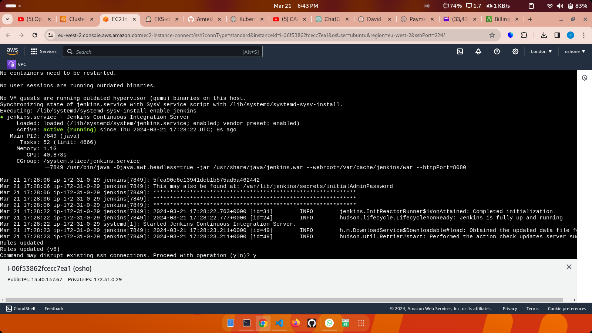
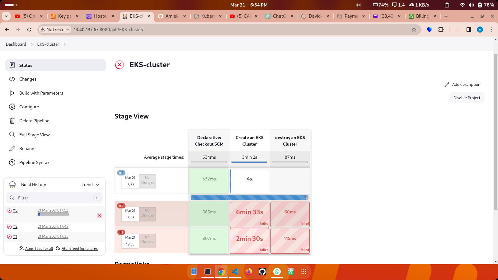
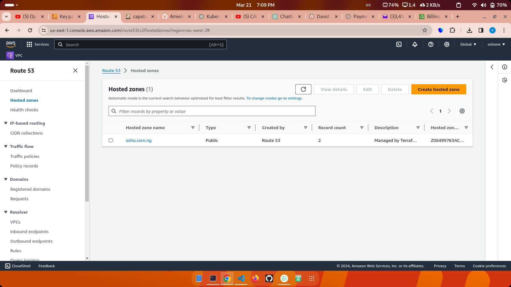
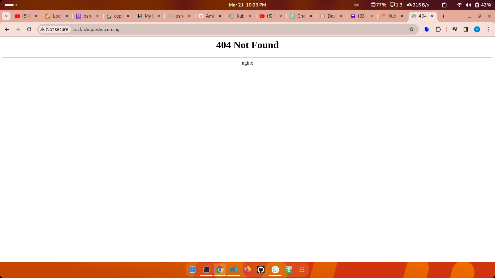
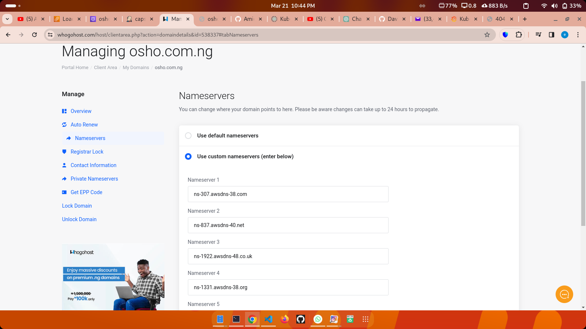
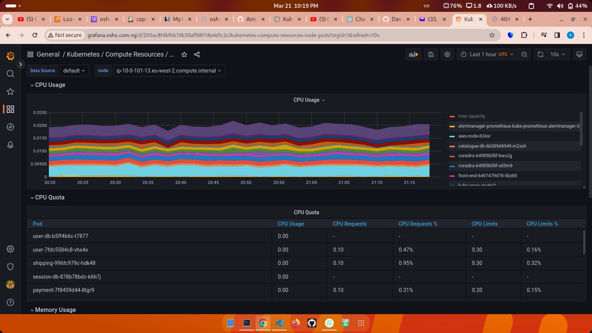

# Microservices-Based Application Deployment on Kubernetes

This project focuses on deploying a microservices-based application, specifically the Socks Shop, using a modern approach that emphasizes automation, efficiency, and security. The deployment process is automated using Infrastructure as Code (IaC), ensuring rapid and reliable deployment on Kubernetes.

## Table of Contents

- [Project Overview](#project-overview)
- [Setup Details Explained](#setup-details-explained)
- [Task Instructions](#task-instructions)
- [Project Goals Summarized](#project-goals-summarized)
- [Setup Instructions](#setup-instructions)
- [Monitoring and Alerts](#monitoring-and-alerts)
- [Logging](#logging)
- [Security and HTTPS](#security-and-https)
- [Extra Project Requirements](#extra-project-requirements)
- [Testing and Validation](#testing-and-validation)
- [Contributing](#contributing)
- [License](#license)

## Project Overview

The objective of this project is to deploy the Socks Shop application, a demonstration of a microservices architecture, available on GitHub. The deployment process is automated using Infrastructure as Code (IaC) tools like Terraform or Ansible. Modern DevOps practices are followed, including CI/CD pipelines, monitoring, logging, and security measures.

## Setup Details Explained

### Resources

- [Socks Shop Microservices Demo](https://github.com/microservices-demo/microservices-demo.github.io)
- [Detailed Implementation Guide](https://github.com/microservices-demo/microservices-demo/tree/master)

### Task Instructions

1. **Use Infrastructure as Code**: Automate the deployment process using IaC. Ensure that all steps to get the application running on Kubernetes are scripted and easily executable.
   
2. **Focus on Clarity and Maintenance**: Write deployment scripts and configurations that are easy to understand and maintain. Consider future updates or replication of the setup by other team members.

3. **Key Evaluation Criteria**:
   - Deployment Pipeline: Implement a CI/CD pipeline to move the application from code to a running environment.
   - Monitoring and Alerts: Set up Prometheus for monitoring and Alertmanager for alerts.
   - Logging: Ensure the application's operations can be tracked and analyzed through logs.
   - Tools for Setup: Use either Ansible or Terraform for managing configurations. Choose an Infrastructure as a Service (IaaS) provider where your Kubernetes cluster will live.

4. **Security and HTTPS**: Ensure the application is securely accessible over HTTPS using Let’s Encrypt for certificates. Implement network security measures and use Ansible Vault for handling sensitive information securely.

## Project Goals Summarized

This project aims to deploy a microservices-based application using automated tools for quick, reliable, and secure deployment on Kubernetes. By focusing on Infrastructure as Code, a reproducible and maintainable deployment process leveraging modern DevOps practices and tools is created.

## Setup Instructions
### Clone the repository and cd into it

### Run installer.sh to Setup Jenkins, terraform, kubectl, aws and helm.

### Run the cluster-Jenkinsfile file to create and setup the EKS cluster

### Run the Jenkinsfile to deploy the socks-shop application to the created EKS cluster

### Copy Nameserver details over to your respective domain provider

### Wait a few minutes for DNS propagation then visit the respective domain name for the socks-shop and Grafana application.
#### grafana.osho.com.ng

#### sock-shop.osho.com.ng

## Monitoring and Alerts

- Grafana is used for monitoring Kubernetes and application metrics.

## Logging

- Logs from all microservices are centralized for analysis.

## Security and HTTPS

- AWS Certificate Manager is used for obtaining TLS certificates and configuring HTTPS.
- Network security policies are configured within Kubernetes.

## Extra Project Requirements

- HTTPS Requirement: Ensure the application is securely accessible over HTTPS.
- Infrastructure Security: Enhance security by setting up network perimeter security rules.

## Testing and Validation

- Thoroughly test the deployment pipeline, monitoring, logging, and security configurations.
- Validate that the application is accessible over HTTPS and that monitoring and logging are functioning correctly.

## Contributing

Contributions are welcome! Feel free to open issues or submit pull requests.

